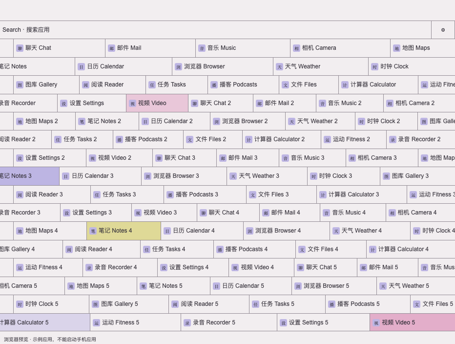

# Fold Tile · 方框流动桌面（实验版）

一个运行在 **Bridge Launcher** 上的 Android 桌面主题。应用以细单线矩形排列，各行缓慢交错自动流动，手指拨动可以加速，松手后惯性衰减并恢复慢速流动；Search 固定在第一行，常用应用放在前面。

**当前定位：个人实验，欢迎自行修改。** 公开主题默认开启慢速自动流动（12 像素/秒），自动变色默认关闭。自动动效曾出现较高负载与发热，可在设置中关闭；本项目仍在优化。手动拨动已在外屏确认恢复；最近一次优化后的内屏、长期温度和耗电仍待验证。

这是主题和兼容性补丁项目，需要 Bridge Launcher 承载。使用 Android 原有解锁和锁屏，不接管指纹或通知。

[观看 25 秒竖屏演示：真实 App 图标、慢速自动流动、手动加速与 Fold8 内外屏比例](https://github.com/pandongxu0873-coder/fold-tile-launcher/releases/download/v0.1.1/fold-tile-promo.mp4)

视频使用主题实际响应触摸的浏览器录制，并展示平板尺寸排布；不等于全机型实测。真实 App 图标仅用于演示，不随主题分发。



## 功能

- 单线方框、原应用图标和名称，浅色 / 深色、密集 / 标准 / 易读。
- 行交错流动、拖动惯性、彩色方框；动效、速度可调。
- 固定 Search，按名称或包名筛选。
- 自选最多 15 个常用应用，调整顺序，集中在 Search 下方。
- 点按打开应用，长按查看应用信息；拖动避免误打开。
- 新安装、更新、卸载应用自动同步；返回桌面再次核对列表。
- 默认慢速自动流动，手动拨动直接跟手，松手后惯性衰减并回到慢速自动流动。自动变色默认关闭；关闭全部动效后，惯性结束即停止动画循环。
- 桌面离开前台或锁屏后暂停动效。自动动画曾在实机测试中出现较高负载与发热，当前限速与按需绘制的效果仍需长期验证，不承诺低耗电。
- 浏览器预览使用虚构数据和自制字符图标，不读取手机信息。

## 安装到手机

1. 从 [Bridge Launcher 官方仓库](https://github.com/bridgelauncher/launcher)安装 Bridge。若官方 alpha 冷启动出现 `ERR_CONNECTION_CLOSED`，可参考下方兼容版说明。
2. 在本仓库 [Releases](https://github.com/pandongxu0873-coder/fold-tile-launcher/releases)下载 `fold-tile-theme.zip`。
3. 解压后，将整个 `fold-tile-theme` 文件夹放到手机存储，例如 `Download/fold-tile-theme/`。HTML、JS 和 CSS 必须放在一起。
4. 在 Bridge 的项目设置中选择这个文件夹，以 `index.html` 作为入口。按 Bridge 提示授予它载入本地主题所需的存储访问。
5. Android 系统设置 → 应用 → 选择默认应用 → 主屏幕应用，选择 Bridge。
6. 已使用旧版且关闭动效的用户，请在齿轮设置中开启 **自动流动**，速度设为 **12**；新版保留你已有的设置，不会强制覆盖。
7. 点第一行的齿轮 → **编辑常用应用**，选择应用并用 ↑ ↓ 调整顺序。

Bridge alpha 要求的“所有文件访问”权限范围由宿主决定。这个主题只调用应用列表、图标、启动和应用信息接口；设置保存在本机 WebView 存储中，不使用远程脚本、统计或上传服务。

### 折叠屏和桌面背景

主题随屏幕尺寸重新排列。现有设备版曾在三星折叠屏上检查展开、合上、默认 Home、锁屏后返回和安装/卸载应用同步；本次公开版本另外通过浏览器尺寸和交互检查。没有覆盖所有 Android 设备和系统版本。

系统桌面壁纸与主题是不同层。若解锁或最近任务动画露出旧壁纸，请在相册中把喜欢的背景设为**主屏幕壁纸**，折叠设备的内外屏可能需要分别设置。原生锁屏可自行搭配，本仓库没有提供锁屏替换程序。

### 可选兼容版 Bridge

Release 中的 `Bridge-FoldFix.apk` 基于官方 `v0.1.0-alpha`，按 MIT 许可提供的非官方修改版本，独立包名 `com.tored.bridgelauncher.foldfix`，与官方版可以共存。FoldFix 2 调整首次页面加载顺序，并修复 Activity 重建时桌面连接被清空的问题；打开应用失败时，主题会恢复流动并显示提示。

补丁源码、上游许可和重建步骤在 [compatibility/](compatibility/README.md)。此兼容 APK 沿用已有设备版；它不是本项目主题的独立安装包，也不代表上游支持或所有设备兼容。

### 切回原桌面

系统设置 → 应用 → 选择默认应用 → 主屏幕应用，选择 One UI 或原有桌面。主题设置中也保留“打开 One UI”入口，该入口仅适用于安装了三星 One UI 的手机。

## 浏览器预览与开发

无构建步骤、无运行时第三方依赖。

```sh
python3 -m http.server 8080 --directory theme
```

打开 `http://localhost:8080`。没有 Bridge 时自动进入示例模式；网页里的应用只能演示点击反馈，不能启动真实手机应用。

```sh
npm test
python3 -m pip install -r tests/requirements.txt
python3 -m playwright install chromium
python3 tests/browser_test.py
```

- `theme/index.html`：页面与设置入口。
- `theme/style.css`：单线网格和排版。
- `theme/app.js`：Bridge 调用、动效、手势、搜索和常用设置。
- `theme/layout.js`：应用分组逻辑。
- `theme/preview.js`：虚构预览数据。

## 来源与许可

主题代码以 MIT 许可发布。流动矩形桌面的视觉方向来自公开视频观察，代码独立实现；未确认原视频的软件名称，不宣称是原软件或官方移植。

Bridge Launcher 与 Bridge API 由 Tored / Bridge Launcher 项目提供。应用图标在手机运行时从系统获取，不随本仓库分发。兼容性修改保留 [上游 MIT 许可](compatibility/LICENSE.upstream)。仓库未包含个人应用排序、手机截图、原视频或签名私钥。
